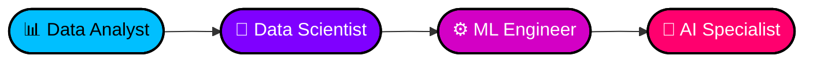

<!-- ╔══════════════════════════════════════════════════════════════╗ -->
<!-- ║                    NEURAL.INTERFACE v2.0                     ║ -->
<!-- ║                  [ RUDRANSH.AI_MODULE ]                      ║ -->
<!-- ╚══════════════════════════════════════════════════════════════╝ -->

<p align="center">
  
</p>

<p align="center">
  
  
  
</p>

<p align="center">
  <a href="https://git.io/typing-svg">
    
  </a>
</p>

<br/>

## `> whoami`

```bash
┌─[rudransh@neural-net]─[~/profile]
└──╼ $ cat identity.yaml
```

```yaml
name:        Rudransh
role:        Aspiring Data Scientist
location:    India 🇮🇳
education:
  - BCA (Bachelor of Computer Applications)
focus:
  - Machine Learning
  - Artificial Intelligence
  - Data Analytics
mindset:
  - "Code > Theory"
  - "Projects > Tutorials"
  - "Real problems > Toy datasets"
currently_building: real-world ML projects
```

<br/>

## `> cat arsenal.json`

<table align="center">
<tr>
<td valign="top" width="50%">

### 🧠 AI / ML / Data
<p>


</p>

</td>
<td valign="top" width="50%">

### 💻 Languages
<p>


</p>

</td>
</tr>
<tr>
<td valign="top" width="50%">

### 🗄 Databases
<p>


</p>

### 🌐 Web / Backend
<p>


</p>

</td>
<td valign="top" width="50%">

### ⚙️ DevOps & Cloud
<p>


</p>

### 🛠 Tools
<p>


</p>

</td>
</tr>
</table>

<br/>

## `> ./run stats.sh`

<p align="center">
  
  
</p>

<p align="center">
  
  
</p>

<br/>

## `> ./render 3d-contrib.svg`

<p align="center">
  
</p>

<br/>

## `> ./trophies --show`

<p align="center">
  
</p>

<br/>

## `> ./snake --animate`

<p align="center">
  
</p>

<br/>

## `> ./roadmap --trace`



<br/>

## `> ./connect --interactive`

<p align="center">
  <a href="mailto:kashyaprudra22@gmail.com">
    
  </a>
  <a href="https://github.com/rudransh-ai-dev">
    
  </a>
</p>

<p align="center">
  
</p>

<!-- ╔══════════════════════════════════════════════════════════════╗ -->
<!-- ║           [END OF TRANSMISSION] — signing off...             ║ -->
<!-- ╚══════════════════════════════════════════════════════════════╝ -->

<p align="center">
  
</p>
